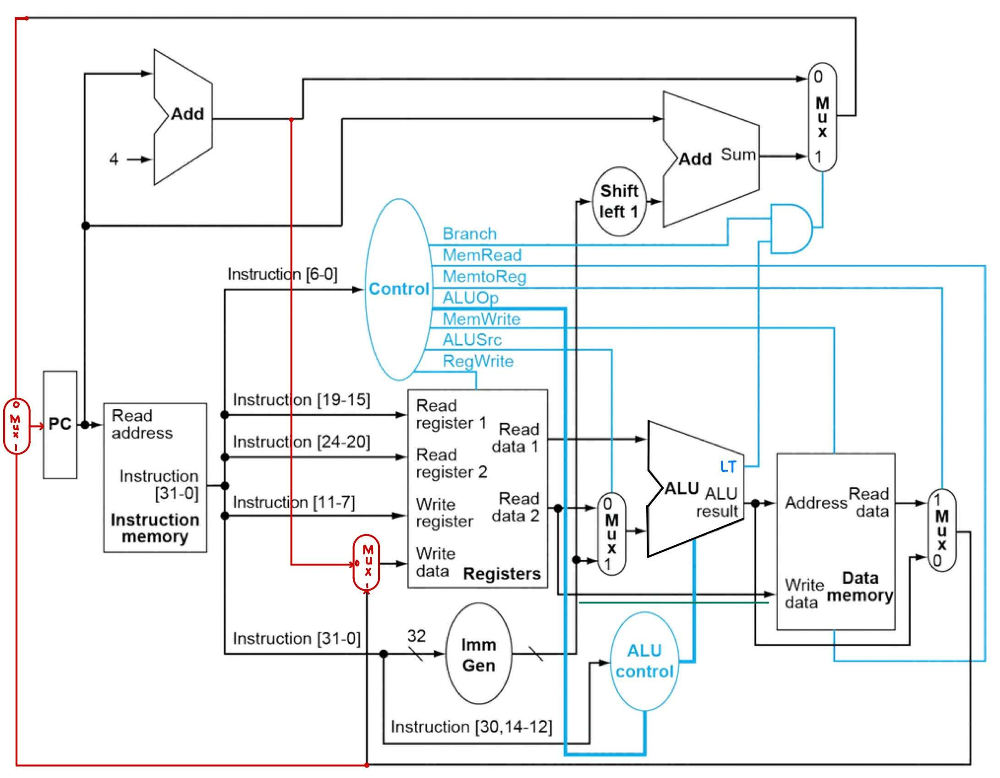

# CPU Simulator: UCLA CS M151B Fall 2023 Computer Assignment 1
This repository contains a C++ solution to Computer Assignment 1 for UCLA CS M151B Fall 2023, a simulator of a 32-bit single cycle RISC-V processor that implements 10 instructions: ADD, SUB, ADDI, XOR, ANDI, SRA, LW, SW, BLT, and JALR.

The implementation follows the datapath depicted below, starting at PC:



## Running
Navigate to the directory containing the extracted implementation, then simply run `make` with the included Makefile.
```
cd CPU_Simulator_CS_M151B_F23_CA1/src
make
```

The exact commands run by `make` are as follows:

```
g++ -Wall -O2 -pipe -fno-plt -fPIC *.cpp -o cpusim
```

The program takes one argument, which is a .txt file containing machine code. Each line contains one byte in unsigned decimal format, and the 4-byte instructions are stored in little-endian format. Example input files as well as their respective assembly programs are provided in the /trace folder.

The program outputs a tuple where the first item is the contents of the CPU's a0 (x10) register and the second item is the contents of the CPU's a1 (x11) register.

Example run:

```
./cpusim ../trace/23instMem-r.txt
(-8,23)
```

## Cleaning up
Navigate to the directory containing the extracted implementation, then simply run `make clean` with the included Makefile.

```
cd CPU_Simulator_CS_M151B_F23_CA1/src
make clean
```

The exact commands run by make clean are as follows:

```
rm -f cpusim
```